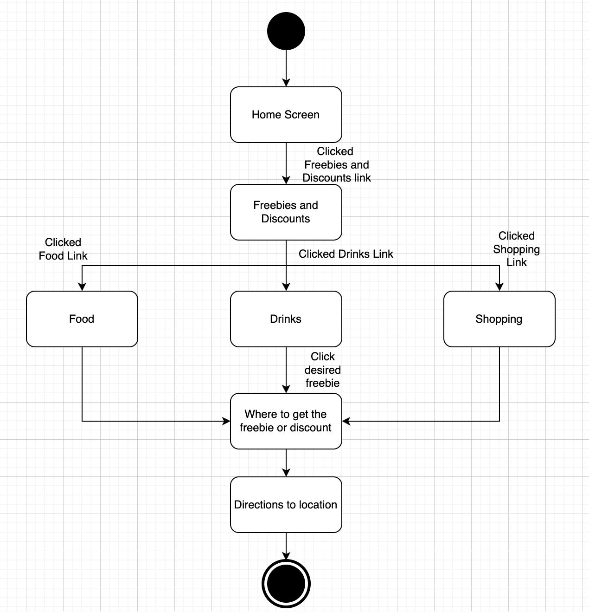

# Specification Phase Exercise

A little exercise to get started with the specification phase of the software development lifecycle. See the [instructions](instructions.md) for more detail.

## Team members

Melissa Kelly, https://github.com/melissalkelly
Apollo Wyndham, https://github.com/a-wyndham1 
Ava August, https://github.com/aaugust22
Shamaamah Ahmad, https://github.com/shamaamahh

## Stakeholders

For our project, we interviewed Becky, a 21-year-old NYU student. They expressed a need for an app to make birthdays easier to navigate in NYC. They told us that a countdown would be helpful to know how many days it is until they get to celebrate their birthday. In addition, a list of many free things and discounts a person can receive for their birthday would also be helpful. Becky also said they want recommendations for places to go out to eat and drink with their friends for their birthday. Lastly, they really want to maximize their birthday experience. Some problems and frustrations Becky had regarding their birthday was indecisiveness. They never know what to do or where to go because of the limitless options. Also, since Becky is a student they are new to the area and need recommendations of where the “hot spots” are. It is easy to see online that a person receives free/discounted things for their birthday but it is frustrating that it is not all in one place. Becky said having an application like this one would help everyone get into the birthday spirit. Finally, having budget-friendly recommendations is a must for a college student living in NYC. 
## Product Vision Statement

The vision for The Ultimate Birthday Experience is to provide college students in NYC with the best recommendations for what to do for their special day through our Birthday Helper App! 

## User Requirements

1. As a college student in NYC, I want to easily keep track of the days until my birthday so that I can schedule my birthday events ahead of time.
2. As a college student in NYC, I want a cool spot to eat so that I can celebrate my birthday with delicious food.
3. As a college student in NYC, I want to know what places are nearby in the city so that I can invite my friends to celebrate in advance.
4. As a college student in NYC, I want to see how much time I have until my birthday so that I have something to look forward to while I am busy with work and school.
5. As a college student in NYC, I want to have all the birthday information in one place so that when my birthday comes I have it all readily available. 
6. As a college student in NYC, I want to know where I can get birthday freebies so that I don’t miss out on any free birthday goodies.
7. As a college student in NYC, I want nightlife recommendations so that I can celebrate my birthday with a group of friends.
8. As a college student in NYC, I want to be aware of any birthday discounts so that I can help my friends save money.
9. As a college student in NYC, I want to have recommendations for local activities so that I will feel comfortable in a new area.
10. As a college student in NYC, I want budget-friendly recommendations so that I can celebrate without financial burdens.

## Activity Diagrams

Activity Diagram for User Story 1: \
As a college student in NYC, I want to know where I can get birthday freebies so that I don’t miss out on any free birthday goodies.\

Activity Diagram for User Story 2: \
As a college student in NYC, I want to have recommendations for local activities so that I will feel comfortable in a new area.\

## Clickable Prototype

See instructions. Delete this line and place a publicly-accessible link to your clickable prototype here.
